# BÁO CÁO KỸ THUẬT VÀ CẨM NANG BẢO VỆ ĐỒ ÁN

## NoteFlow — Ứng dụng quản lý ghi chú cá nhân

> Môn học: **IT4409 – Công nghệ Web và dịch vụ trực tuyến (20252)**  
> Sinh viên: `<HỌ VÀ TÊN>`  
> Mã số học viên: `<MÃ SỐ HỌC VIÊN>`  
> Email: `<EMAIL>`  
> Repository: `<REPOSITORY_URL>`  
> Demo công khai: `<DEMO_URL>`  
> Tài khoản demo: `<DEMO_USERNAME>` / `<DEMO_PASSWORD>`

---

## Cách sử dụng tài liệu này

Tài liệu này có ba mục tiêu:

1. Giúp người mới hiểu từ nền tảng Web đến từng lớp trong source code.
2. Làm tài liệu tham khảo khi thuyết trình và trả lời vấn đáp với giảng viên.
3. Làm nguồn nội dung để rút gọn thành file PDF nộp cuối kỳ.

Các đường dẫn dạng [SecurityConfig.java](src/main/java/ziang/com/it4409/noteapp/config/SecurityConfig.java)
có thể được bấm để mở file tương ứng nếu trình đọc Markdown hỗ trợ liên kết tương đối.

> **Lưu ý:** Đây là tài liệu giải thích đầy đủ. File PDF nộp chính thức nên được rút gọn,
> bổ sung ảnh chụp giao diện, thông tin sinh viên, URL repository, URL demo và tài khoản demo.

### Trạng thái hiện tại

| Hạng mục | Trạng thái |
|---|---|
| CRUD ghi chú | Hoàn thành |
| Phân quyền dữ liệu theo người dùng | Hoàn thành |
| Đăng ký, đăng nhập, đăng xuất | Hoàn thành |
| Tìm kiếm, lọc, phân trang | Hoàn thành |
| Infinite scroll và Load More | Hoàn thành |
| Giao diện responsive | Hoàn thành |
| Tiếng Việt và tiếng Anh | Hoàn thành |
| Light, dark và system theme | Hoàn thành |
| Validation và xử lý lỗi tập trung | Hoàn thành |
| Docker development/production | Đã cấu hình |
| Kiểm thử tự động | 19 test đang pass |
| VPS, Tailscale, Cloudflare Tunnel chính thức | Thực hiện sau khi kiểm thử local |

---

## Mục lục

1. [Tóm tắt đồ án](#tom-tat)
2. [Đối chiếu yêu cầu đề thi](#yeu-cau)
3. [Kiến thức nền cần hiểu](#kien-thuc-nen)
4. [Công nghệ và lý do lựa chọn](#cong-nghe)
5. [Kiến trúc tổng thể](#kien-truc)
6. [Cấu trúc source code](#cau-truc-source)
7. [Thiết kế cơ sở dữ liệu](#co-so-du-lieu)
8. [Xác thực, phân quyền và bảo mật](#bao-mat)
9. [Luồng xử lý backend](#backend)
10. [API route và mã trạng thái HTTP](#routes)
11. [Frontend, Thymeleaf và JavaScript](#frontend)
12. [Validation và xử lý lỗi](#validation-loi)
13. [Cấu hình dev, test và prod](#cau-hinh)
14. [Hướng dẫn chạy local](#chay-local)
15. [Kiểm thử](#kiem-thu)
16. [Đóng gói và triển khai](#trien-khai)
17. [Kịch bản demo với giảng viên](#kich-ban-demo)
18. [Câu hỏi vấn đáp thường gặp](#van-dap)
19. [Troubleshooting](#troubleshooting)
20. [Giới hạn và hướng phát triển](#gioi-han)
21. [Checklist nộp bài](#checklist)
22. [Tài liệu chính thức](#tai-lieu-tham-khao)
23. [Phụ lục lệnh thường dùng](#phu-luc)

---

<a id="tom-tat"></a>

## 1. Tóm tắt đồ án

NoteFlow là ứng dụng Web quản lý ghi chú cá nhân. Người dùng có thể:

- Đăng ký tài khoản.
- Đăng nhập và đăng xuất bằng HTTP session.
- Tạo, xem danh sách, xem chi tiết, chỉnh sửa và xóa ghi chú.
- Phân loại ghi chú thành `PERSONAL`, `WORK`, `STUDY`, `IDEA`, `OTHER`.
- Ghim hoặc bỏ ghim ghi chú.
- Tìm kiếm theo tiêu đề và nội dung.
- Lọc theo danh mục.
- Tải thêm ghi chú bằng infinite scrolling hoặc nút **Xem thêm**.
- Chuyển đổi tiếng Việt/tiếng Anh.
- Chuyển giao diện sáng/tối/theo hệ thống.

Điểm quan trọng nhất của hệ thống là **mọi dữ liệu ghi chú đều bị giới hạn theo tài khoản
đang đăng nhập**. Trình duyệt không được gửi `userId` để quyết định chủ sở hữu. Backend tự
lấy người dùng từ Spring Security rồi truy vấn theo cặp `(noteId, userId)`.

### Phạm vi

Đây là một **server-rendered monolith**:

- Một ứng dụng Spring Boot xử lý giao diện, nghiệp vụ và bảo mật.
- Một PostgreSQL lưu dữ liệu.
- Thymeleaf dựng HTML tại server.
- JavaScript chỉ hỗ trợ tương tác nhỏ, không thay thế backend.

Không sử dụng React, Vue, JWT, microservice, Redis hoặc Kubernetes. Cách thiết kế này phù
hợp với quy mô đồ án: ít thành phần, dễ giải thích, dễ kiểm thử và dễ triển khai.

### Tài liệu nguồn của đề tài

- [Đề thi chính thức](<20252 - IT4409 - De thi cuoi ky.pdf>)
- [Kế hoạch triển khai chi tiết](plan.md)
- [Hướng dẫn chạy nhanh](README.md)
- [Dàn ý PDF nộp bài](docs/FINAL_SUBMISSION.md)

---

<a id="yeu-cau"></a>

## 2. Đối chiếu yêu cầu đề thi

| Yêu cầu trong đề | Cách dự án đáp ứng | Code minh chứng |
|---|---|---|
| Create | Form tạo ghi chú và `POST /notes` | [NoteController.java](src/main/java/ziang/com/it4409/noteapp/note/NoteController.java) |
| Read/List | Danh sách phân trang tại `GET /notes` | [list.html](src/main/resources/templates/notes/list.html) |
| Read/Detail | Chi tiết tại `GET /notes/{id}` | [detail.html](src/main/resources/templates/notes/detail.html) |
| Update | Form sửa và `POST /notes/{id}` | [form.html](src/main/resources/templates/notes/form.html) |
| Delete | Modal xác nhận và `POST /notes/{id}/delete` | [delete-modal.html](src/main/resources/templates/fragments/delete-modal.html) |
| Dữ liệu gắn với `userId` | `Note.user` là quan hệ `ManyToOne` bắt buộc | [Note.java](src/main/java/ziang/com/it4409/noteapp/note/Note.java) |
| Mỗi user chỉ thấy dữ liệu của mình | Mọi query đều có `userId` của user đang đăng nhập | [NoteRepository.java](src/main/java/ziang/com/it4409/noteapp/note/NoteRepository.java) |
| Có trường phân loại/lọc | Enum `NoteCategory` và bộ lọc danh mục | [NoteCategory.java](src/main/java/ziang/com/it4409/noteapp/note/NoteCategory.java) |
| Responsive desktop/mobile | Bootstrap grid: 1/2/3 cột | [app.css](src/main/resources/static/css/app.css) |
| Validate đầu vào | DTO với `@NotBlank`, `@Size`, `@Email`, `@NotNull` | [NoteForm.java](src/main/java/ziang/com/it4409/noteapp/note/dto/NoteForm.java) |
| Xử lý lỗi tập trung | `@ControllerAdvice` trả trang 400/404/500 | [GlobalExceptionHandler.java](src/main/java/ziang/com/it4409/noteapp/exception/GlobalExceptionHandler.java) |
| HTTP status phù hợp | 400 cho form sai, 404 cho note không thuộc user, 409 cho trùng tài khoản, 500 cho lỗi ngoài dự kiến | [AuthController.java](src/main/java/ziang/com/it4409/noteapp/auth/AuthController.java) |
| Link source | Điền `<REPOSITORY_URL>` trước khi nộp | [FINAL_SUBMISSION.md](docs/FINAL_SUBMISSION.md) |
| Link demo hoạt động | Điền `<DEMO_URL>` sau khi deploy | [FINAL_SUBMISSION.md](docs/FINAL_SUBMISSION.md) |
| Tài khoản demo | Tạo idempotent từ biến môi trường | [DemoDataInitializer.java](src/main/java/ziang/com/it4409/noteapp/config/DemoDataInitializer.java) |

### Yêu cầu tối thiểu và phần nâng cao

Các chức năng sau **không bắt buộc trực tiếp trong đề**, nhưng làm sản phẩm hoàn chỉnh hơn:

- Đăng ký và đăng nhập bằng Spring Security.
- Ghim ghi chú.
- Live search không tải lại toàn trang.
- Infinite scrolling.
- Giao diện hai ngôn ngữ.
- Dark mode.
- Docker Compose và Cloudflare Tunnel.
- Bộ kiểm thử tự động.

Khi báo cáo, nên trình bày yêu cầu bắt buộc trước, sau đó mới giới thiệu phần nâng cao.

---

<a id="kien-thuc-nen"></a>

## 3. Kiến thức nền cần hiểu

### 3.1 Web client–server

Trình duyệt là **client**. Spring Boot là **server**. Client gửi HTTP request; server xử lý
và trả HTTP response.

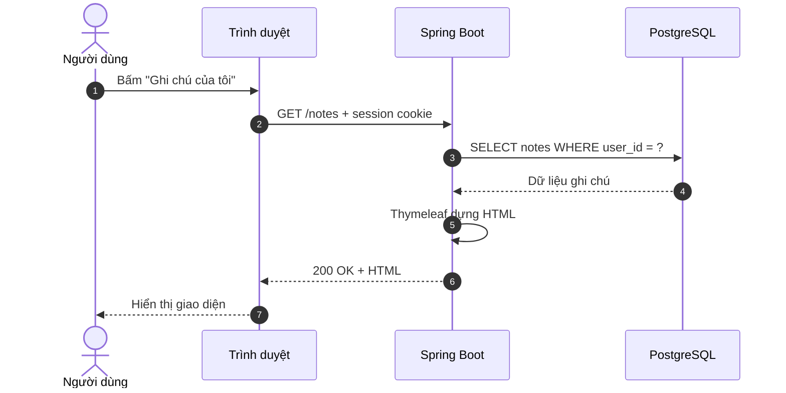

### 3.2 HTTP request và response

Một request có:

- Method: `GET`, `POST`, ...
- URL: `/notes/15/edit`.
- Header: cookie, loại nội dung, ngôn ngữ, ...
- Body: dữ liệu form với các request `POST`.

Một response có:

- Status: `200`, `302`, `400`, `404`, `409`, `500`, ...
- Header: `Content-Type`, `Location`, cookie, ...
- Body: HTML/CSS/JavaScript hoặc dữ liệu khác.

### 3.3 CRUD

CRUD là bốn thao tác cơ bản với dữ liệu:

| Chữ | Ý nghĩa | Trong dự án |
|---|---|---|
| C | Create | Tạo ghi chú |
| R | Read | Xem danh sách và chi tiết |
| U | Update | Chỉnh sửa, ghim/bỏ ghim |
| D | Delete | Xóa vĩnh viễn |

### 3.4 MVC

MVC trong dự án được hiểu như sau:

- **Model:** entity, DTO và dữ liệu controller đưa vào view.
- **View:** template Thymeleaf tạo HTML.
- **Controller:** nhận request, gọi service, chọn view hoặc redirect.

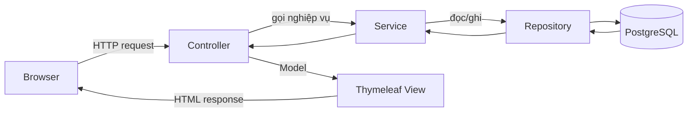

### 3.5 Các thuật ngữ quan trọng

| Thuật ngữ | Giải thích ngắn |
|---|---|
| Entity | Lớp Java ánh xạ tới bảng database |
| DTO/Form object | Đối tượng nhận dữ liệu từ form, tách khỏi entity |
| Repository | Lớp truy cập dữ liệu thông qua Spring Data JPA |
| Service | Nơi đặt nghiệp vụ, transaction và quy tắc phân quyền dữ liệu |
| Controller | Điểm nhận HTTP request và trả view/redirect |
| Dependency Injection | Spring tạo object và truyền dependency qua constructor |
| Bean | Object được Spring quản lý |
| ORM | Ánh xạ object Java sang bảng quan hệ |
| JPA | Chuẩn API persistence của Java |
| Hibernate | Implementation JPA được Spring Boot sử dụng |
| Session | Trạng thái đăng nhập được server liên kết với cookie của browser |
| Authentication | Xác định người dùng là ai |
| Authorization | Xác định người dùng được phép làm gì |
| CSRF | Tấn công lợi dụng browser gửi request thay người dùng |
| PRG | Post/Redirect/Get, tránh submit lại form khi refresh |
| i18n | Internationalization, hỗ trợ nhiều ngôn ngữ |
| Profile | Nhóm cấu hình riêng cho dev/test/prod |

---

<a id="cong-nghe"></a>

## 4. Công nghệ và lý do lựa chọn

| Công nghệ | Vai trò | Lý do |
|---|---|---|
| Java 21 | Ngôn ngữ backend | Phiên bản LTS, mạnh về type-safety và hệ sinh thái server |
| Spring Boot 4.1.0 | Khởi tạo và cấu hình ứng dụng | Auto-configuration, embedded server, Maven packaging |
| Spring MVC | Xử lý HTTP | Phù hợp mô hình controller + server-rendered view |
| Thymeleaf | Render HTML | Tích hợp tốt với Spring MVC, Security và message bundles |
| Spring Security | Login, session, CSRF | Cung cấp filter chain và bảo vệ chuẩn |
| Spring Data JPA | Data access | Giảm boilerplate repository, hỗ trợ query và pagination |
| Hibernate | ORM | Triển khai JPA, ánh xạ entity ↔ database |
| Jakarta Validation | Validation server-side | Constraint khai báo rõ trên DTO |
| PostgreSQL | Database quan hệ | Constraint, transaction, index và độ tin cậy tốt |
| Bootstrap 5.3 | Responsive UI | Grid và component sẵn có, hỗ trợ color mode |
| Vanilla JavaScript | Tương tác frontend | Không cần build pipeline hay framework frontend riêng |
| Maven Wrapper | Build/test/package | Máy khác có thể dùng đúng Maven version |
| Docker Compose | Môi trường và deploy | Khai báo app, database, health check, volume bằng code |
| Cloudflare Tunnel | Public HTTPS | Không cần mở inbound port trên router/VPS |
| Tailscale | Quản trị riêng | Truy cập VPS/private network mà không công khai SSH/database |

Danh sách dependency thực tế nằm trong [pom.xml](pom.xml).

### Tại sao không dùng React hoặc JWT?

Ứng dụng là website cùng origin, giao diện được render ở server. HTTP session phù hợp hơn JWT
vì browser chỉ cần giữ session cookie; backend quản lý authentication context. Thymeleaf giảm
số dự án cần build và giúp CSRF token được tích hợp trực tiếp vào form. React/JWT sẽ tăng số
thành phần, CORS, token storage và độ khó triển khai nhưng không tạo thêm giá trị đáng kể cho
đề bài này.

---

<a id="kien-truc"></a>

## 5. Kiến trúc tổng thể

### 5.1 System context

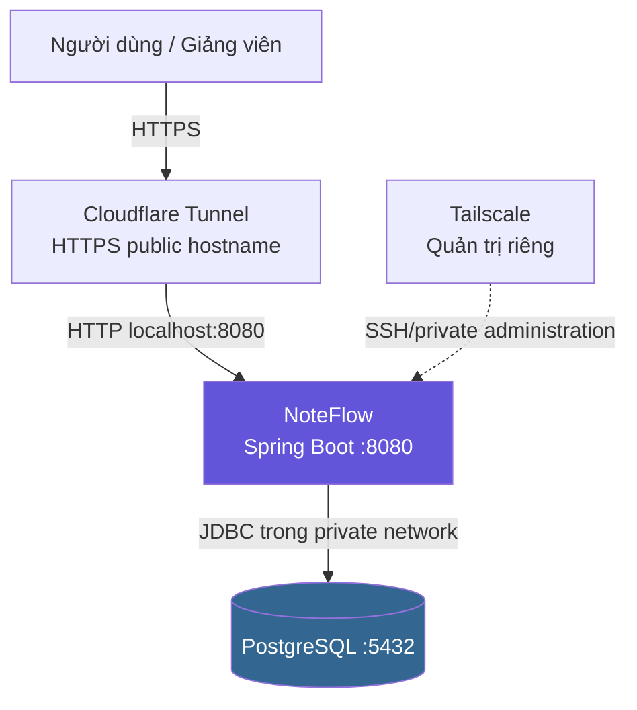

Khi chạy local, Cloudflare và Tailscale không bắt buộc. Browser truy cập trực tiếp
`http://localhost:8080`.

### 5.2 Kiến trúc layered monolith

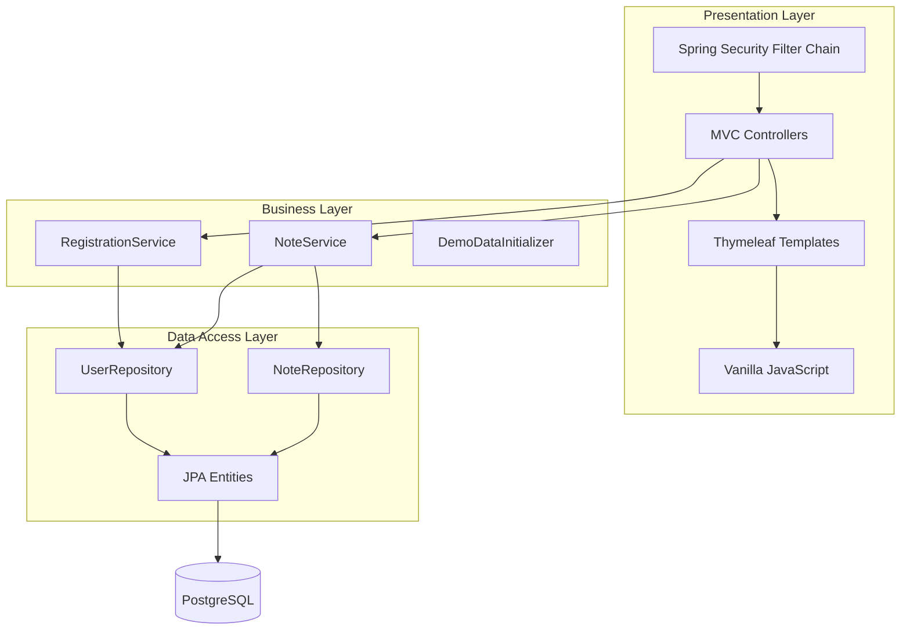

### 5.3 Nguyên tắc phụ thuộc

Controller không tự viết SQL. Repository không quyết định giao diện. Template không quyết định
chủ sở hữu. Mỗi lớp có trách nhiệm riêng:

```text
Controller -> Service -> Repository -> Database
Controller -> Model -> Thymeleaf -> HTML
```

Điều này giúp:

- Dễ đọc code.
- Dễ test service mà không cần browser.
- Dễ thay đổi giao diện mà không đổi nghiệp vụ.
- Giảm nguy cơ bỏ sót kiểm tra owner ở nhiều controller.

---

<a id="cau-truc-source"></a>

## 6. Cấu trúc source code

```text
NoteApp/
├── pom.xml
├── Dockerfile
├── compose.dev.yaml
├── compose.yaml
├── .env.example
├── README.md
├── report.md
├── docs/
│   └── FINAL_SUBMISSION.md
└── src/
    ├── main/
    │   ├── java/ziang/com/it4409/noteapp/
    │   │   ├── NoteAppApplication.java
    │   │   ├── auth/
    │   │   ├── config/
    │   │   ├── exception/
    │   │   ├── note/
    │   │   ├── user/
    │   │   └── web/
    │   └── resources/
    │       ├── templates/
    │       ├── static/
    │       ├── messages*.properties
    │       └── application*.yaml
    └── test/
        ├── java/.../
        └── resources/application-test.yaml
```

### Bản đồ file quan trọng

| Muốn hiểu | Bắt đầu từ file |
|---|---|
| Chương trình khởi động ở đâu? | [NoteAppApplication.java](src/main/java/ziang/com/it4409/noteapp/NoteAppApplication.java) |
| Route nào public/private? | [SecurityConfig.java](src/main/java/ziang/com/it4409/noteapp/config/SecurityConfig.java) |
| Login lấy user từ DB thế nào? | [CustomUserDetailsService.java](src/main/java/ziang/com/it4409/noteapp/user/CustomUserDetailsService.java) |
| Đăng ký và hash password? | [RegistrationService.java](src/main/java/ziang/com/it4409/noteapp/auth/RegistrationService.java) |
| Note có field gì? | [Note.java](src/main/java/ziang/com/it4409/noteapp/note/Note.java) |
| Ownership nằm ở đâu? | [NoteService.java](src/main/java/ziang/com/it4409/noteapp/note/NoteService.java) |
| Query tìm kiếm? | [NoteRepository.java](src/main/java/ziang/com/it4409/noteapp/note/NoteRepository.java) |
| Route CRUD? | [NoteController.java](src/main/java/ziang/com/it4409/noteapp/note/NoteController.java) |
| Giao diện danh sách? | [list.html](src/main/resources/templates/notes/list.html) |
| Card ghi chú? | [note-cards.html](src/main/resources/templates/notes/fragments/note-cards.html) |
| Live search/infinite scroll? | [notes.js](src/main/resources/static/js/notes.js) |
| Theme? | [theme.js](src/main/resources/static/js/theme.js) |
| Chuỗi tiếng Việt/Anh? | [messages.properties](src/main/resources/messages.properties), [messages_en.properties](src/main/resources/messages_en.properties) |
| Error mapping? | [GlobalExceptionHandler.java](src/main/java/ziang/com/it4409/noteapp/exception/GlobalExceptionHandler.java) |
| Test bảo mật? | [NoteServiceTest.java](src/test/java/ziang/com/it4409/noteapp/note/NoteServiceTest.java) |

---

<a id="co-so-du-lieu"></a>

## 7. Thiết kế cơ sở dữ liệu

### 7.1 Sơ đồ ER

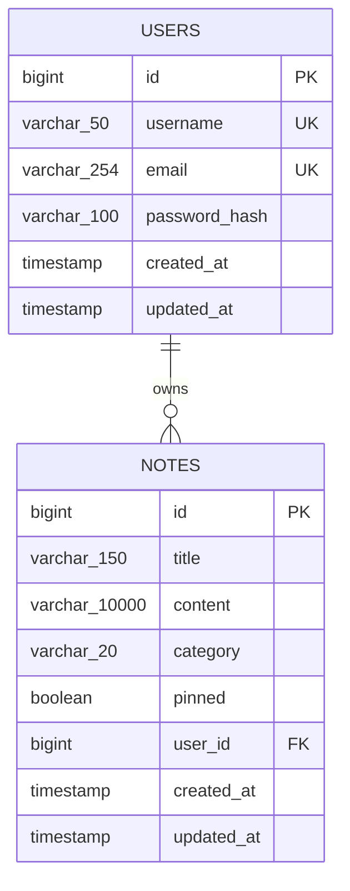

`USERS ||--o{ NOTES` nghĩa là một user có thể có 0 hoặc nhiều note; một note bắt buộc thuộc
đúng một user.

### 7.2 Entity `User`

File: [User.java](src/main/java/ziang/com/it4409/noteapp/user/User.java)

| Field | Constraint | Ý nghĩa |
|---|---|---|
| `id` | Primary key, auto increment | Định danh nội bộ |
| `username` | Required, unique, 3–50 ở DTO | Dùng đăng nhập |
| `email` | Required, unique, tối đa 254 | Thông tin tài khoản |
| `passwordHash` | Required | Chỉ lưu BCrypt hash |
| `createdAt` | Required, immutable | Thời điểm tạo |
| `updatedAt` | Required | Thời điểm cập nhật |

Username và email được chuẩn hóa lowercase trước khi lưu. Điều này tránh hai tài khoản gần như
trùng nhau như `Demo` và `demo`.

### 7.3 Entity `Note`

File: [Note.java](src/main/java/ziang/com/it4409/noteapp/note/Note.java)

| Field | Constraint | Ý nghĩa |
|---|---|---|
| `id` | Primary key | Định danh note |
| `title` | Required, tối đa 150 | Tiêu đề |
| `content` | Required, tối đa 10.000 | Nội dung plain text |
| `category` | Required enum string | Phân loại/lọc |
| `pinned` | Required, mặc định false | Ưu tiên hiển thị |
| `user` | Required `ManyToOne` | Chủ sở hữu |
| `createdAt` | Required | Ngày tạo |
| `updatedAt` | Required | Ngày sửa gần nhất |

### 7.4 Tại sao enum được lưu bằng chuỗi?

```java
@Enumerated(EnumType.STRING)
private NoteCategory category;
```

Database lưu `STUDY` thay vì số `2`. Nếu thứ tự enum thay đổi, dữ liệu vẫn giữ đúng nghĩa.
Tên hiển thị “Học tập” hoặc “Study” chỉ được dịch ở message bundle, không lưu bản dịch vào DB.

### 7.5 Timestamp tự động

`@PrePersist` chạy trước khi insert, đặt cả `createdAt` và `updatedAt`. `@PreUpdate` chạy trước
khi update, chỉ đổi `updatedAt`.

### 7.6 Index

| Index | Mục đích |
|---|---|
| Unique `users.username` | Không cho trùng username |
| Unique `users.email` | Không cho trùng email |
| `idx_notes_user` | Danh sách note của một owner |
| `idx_notes_user_category` | Lọc category trong phạm vi owner |
| `idx_notes_user_order` | Hỗ trợ owner + pin + updated time + id |

PostgreSQL tự tạo unique index khi khai báo primary key hoặc unique constraint. Xem
[PostgreSQL — Unique Indexes](https://www.postgresql.org/docs/17/indexes-unique.html).

> Index tăng tốc đọc nhưng làm insert/update tốn thêm chi phí. Dự án chỉ thêm index phục vụ
> các query thực tế, không index mọi field.

### 7.7 Schema lifecycle

Project dùng:

```yaml
spring:
  jpa:
    hibernate:
      ddl-auto: update
```

Hibernate tự tạo/cập nhật schema. Đây là quyết định theo kế hoạch đồ án nhỏ. Với hệ thống thực
tế có nhiều môi trường và dữ liệu quan trọng, nên chuyển sang Flyway hoặc Liquibase để version
hóa migration.

---

<a id="bao-mat"></a>

## 8. Xác thực, phân quyền và bảo mật

### 8.1 Authentication khác Authorization

- **Authentication:** kiểm tra username/password để biết người dùng là ai.
- **Authorization:** sau khi biết user, kiểm tra user được phép truy cập note nào.

Đăng nhập thành công **không tự động** bảo đảm ownership. Vì vậy dự án còn kiểm tra owner trong
service/repository.

### 8.2 Luồng đăng nhập

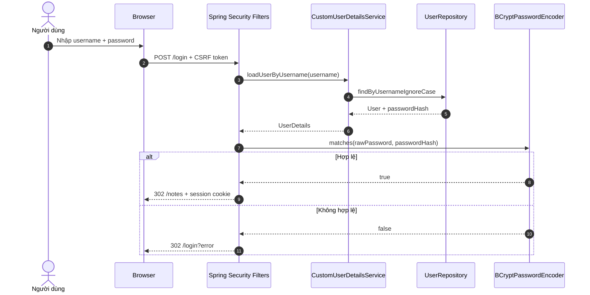

Spring Security xử lý `POST /login`; controller chỉ render `GET /login`. Cấu hình nằm ở
[SecurityConfig.java](src/main/java/ziang/com/it4409/noteapp/config/SecurityConfig.java).

Tài liệu chính thức mô tả form login và yêu cầu field `username`, `password`, CSRF token tại
[Spring Security — Form Login](https://docs.spring.io/spring-security/reference/7.0/servlet/authentication/passwords/form.html).

### 8.3 HTTP session

Sau khi login, server lưu `SecurityContext` liên quan đến session. Browser giữ cookie session và
gửi lại ở request sau. Password không được gửi lại trong mỗi request.

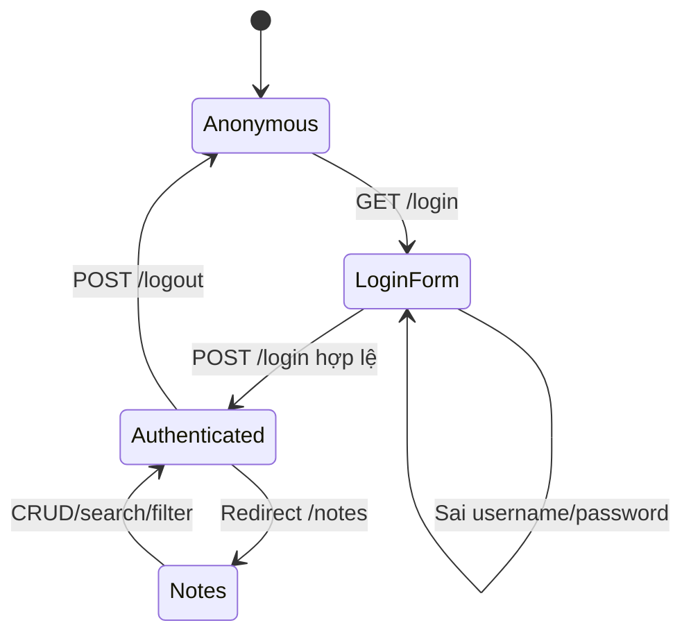

### 8.4 BCrypt

Password được chuyển thành BCrypt hash trong
[RegistrationService.java](src/main/java/ziang/com/it4409/noteapp/auth/RegistrationService.java).

BCrypt là **hàm một chiều thích nghi**, không phải mã hóa có thể giải mã. Spring Security giải
thích rằng adaptive one-way functions cố tình tốn tài nguyên để làm brute-force khó hơn; BCrypt
cũng tự dùng salt. Xem [Spring Security — Password Storage](https://docs.spring.io/spring-security/reference/features/authentication/password-storage.html).

```text
Password người dùng nhập
        |
        v
BCryptPasswordEncoder.encode(...)
        |
        v
$2a$10$...  -> lưu vào users.password_hash
```

Khi login, hệ thống dùng `matches(raw, hash)`, không giải mã hash.

### 8.5 CSRF

CSRF xảy ra khi website độc hại khiến browser của user đang đăng nhập gửi request thay đổi dữ
liệu tới ứng dụng. Cookie session có thể được browser tự gửi, nên request cần thêm token mà site
độc hại không biết.

Spring Security bật CSRF mặc định. Mọi action thay đổi state dùng `POST`:

- Đăng ký.
- Đăng nhập/đăng xuất.
- Tạo/sửa/xóa note.
- Ghim/bỏ ghim.

Thymeleaf tự chèn hidden CSRF token vào form `POST`; modal xóa cũng đặt token rõ ràng. Theo
[Spring Security CSRF reference](https://docs.spring.io/spring-security/reference/servlet/exploits/csrf.html),
request thiếu/sai token sẽ bị từ chối.

### 8.6 Quy tắc ownership — bảo mật quan trọng nhất

Không có form hoặc query parameter `userId`. Backend làm như sau:

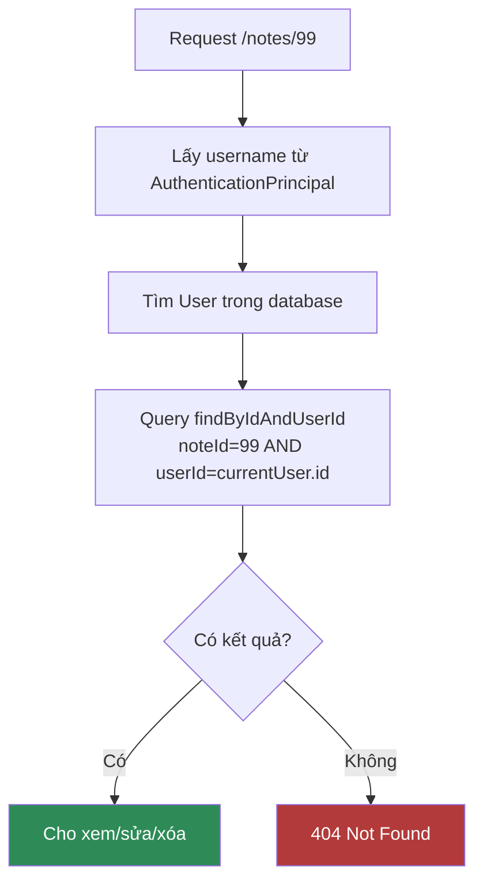

Điểm then chốt trong [NoteRepository.java](src/main/java/ziang/com/it4409/noteapp/note/NoteRepository.java):

```java
Optional<Note> findByIdAndUserId(Long id, Long userId);
```

Và trong [NoteService.java](src/main/java/ziang/com/it4409/noteapp/note/NoteService.java):

```java
return noteRepository.findByIdAndUserId(noteId, owner.getId())
        .orElseThrow(NoteNotFoundException::new);
```

### 8.7 Tại sao note của user khác trả 404 thay vì 403?

Nếu trả 403 cho note tồn tại nhưng không thuộc user và 404 cho note không tồn tại, kẻ tấn công
có thể dò ID để biết tài nguyên nào tồn tại. Trả cùng 404 cho cả hai trường hợp tránh tiết lộ
thông tin.

### 8.8 Defense in depth

| Lớp | Cơ chế bảo vệ |
|---|---|
| Browser/form | Required fields, modal xác nhận |
| Spring Security filter | Public/private route, session, CSRF |
| Controller | `@Valid`, không nhận owner ID |
| Service | Lấy owner từ username đã xác thực |
| Repository | Query luôn kèm `userId` |
| Database | PK, FK, unique, NOT NULL |
| Deployment | DB không public, app chỉ bind localhost trên VPS |

### 8.9 Giới hạn bảo mật cần nói đúng

- Ownership đang được enforcement ở application layer, không dùng PostgreSQL Row-Level Security.
- Ai có quyền truy cập trực tiếp DB vẫn có thể đọc dữ liệu.
- Nội dung note không được mã hóa riêng ở database.
- HTTPS do Cloudflare Tunnel cung cấp khi public; local dev dùng HTTP.
- Demo password local phải được thay bằng secret mạnh khi deploy.

---

<a id="backend"></a>

## 9. Luồng xử lý backend

### 9.1 Khởi động ứng dụng

[NoteAppApplication.java](src/main/java/ziang/com/it4409/noteapp/NoteAppApplication.java) gọi:

```java
SpringApplication.run(NoteAppApplication.class, args);
```

`@SpringBootApplication` kết hợp component scanning, auto-configuration và configuration. Spring
tìm các class `@Controller`, `@Service`, `@Component`, `@Configuration`, tạo bean và inject qua
constructor.

### 9.2 Đăng ký tài khoản

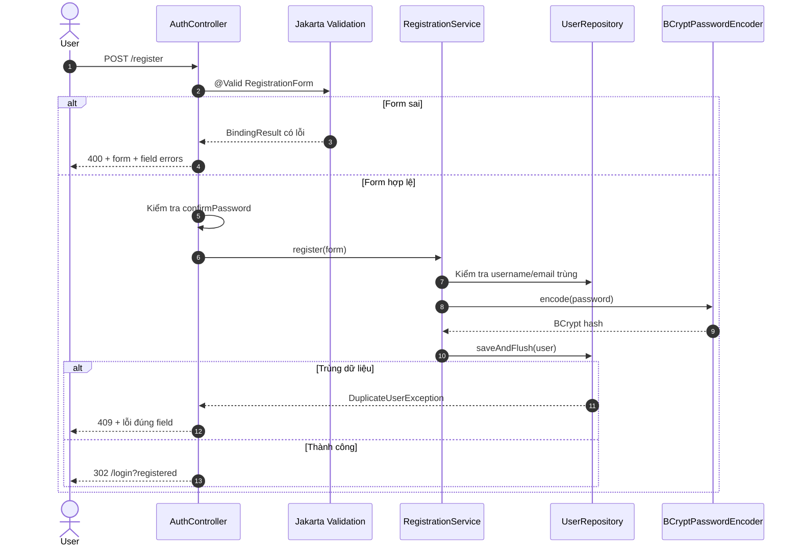

DTO [RegistrationForm.java](src/main/java/ziang/com/it4409/noteapp/auth/dto/RegistrationForm.java)
tách input browser khỏi entity `User`.

### 9.3 Demo account idempotent

[DemoDataInitializer.java](src/main/java/ziang/com/it4409/noteapp/config/DemoDataInitializer.java)
chạy khi app start:

1. Đọc `DEMO_USERNAME`, `DEMO_EMAIL`, `DEMO_PASSWORD`.
2. Nếu username đã tồn tại: không làm gì.
3. Nếu chưa: BCrypt password và tạo account.

“Idempotent” nghĩa là chạy nhiều lần vẫn cho cùng trạng thái cuối, không tạo trùng và không tự
đổi password mỗi lần restart.

> Nếu demo user đã tồn tại, thay `DEMO_PASSWORD` rồi restart **không đổi password cũ**. Đây là
> hành vi cố ý để restart không khóa tài khoản demo ngoài ý muốn.

### 9.4 Tạo note

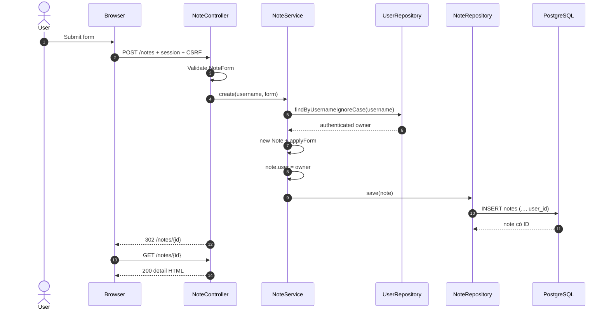

Owner được gán từ authenticated username, không lấy từ form.

### 9.5 Sửa note

Trước khi update, service gọi `getOwnedNote(username, noteId)`. Chỉ entity đã được truy vấn đúng
owner mới được sửa. `applyForm` chỉ cập nhật `title`, `content`, `category`; không có dòng nào
thay `user`.

### 9.6 Xóa note

Controller nhận ID, service gọi `getOwnedNote`, sau đó mới `delete`. Việc dùng `POST` và CSRF
ngăn xóa bằng một link GET đơn giản.

### 9.7 Ghim note

Ghim là một update nhỏ:

```java
note.setPinned(!note.isPinned());
```

Nhưng vẫn phải lấy note bằng owner-scoped query trước.

### 9.8 Search và filter ở database

JPQL trong [NoteRepository.java](src/main/java/ziang/com/it4409/noteapp/note/NoteRepository.java):

```sql
select n from Note n
where n.user.id = :userId
  and (:category is null or n.category = :category)
  and (
        :keyword = ''
        or lower(n.title) like lower(concat('%', :keyword, '%'))
        or lower(n.content) like lower(concat('%', :keyword, '%'))
  )
```

Đây là JPQL theo tên entity/property, không phải SQL theo tên bảng/cột. Hibernate dịch JPQL
thành SQL phù hợp PostgreSQL.

### 9.9 Pagination và sort ổn định

Page size là 12. Thứ tự:

1. `pinned DESC`
2. `updatedAt DESC`
3. `id DESC`

`id` là tie-breaker để hai note có cùng thời gian vẫn có thứ tự xác định. Spring Data hỗ trợ
`Page`, `Pageable`, `PageRequest` và `Sort`; xem
[Spring Data JPA — Core concepts](https://docs.spring.io/spring-data/jpa/reference/repositories/core-concepts.html).

### 9.10 Transaction

- Query chỉ đọc dùng `@Transactional(readOnly = true)`.
- Create/update/delete/pin dùng `@Transactional`.

Transaction bảo đảm nhóm thao tác database thành một đơn vị nhất quán. Nếu exception xảy ra
trong transaction ghi, Spring có thể rollback thay vì để dữ liệu ở trạng thái dở dang.

### 9.11 Post/Redirect/Get

Sau POST thành công, controller không render ngay mà trả redirect:

```text
POST /notes -> 302 Location: /notes/15 -> GET /notes/15
```

Nhờ vậy refresh trang chi tiết không submit lại form tạo note.

---

<a id="routes"></a>

## 10. API route và mã trạng thái HTTP

### 10.1 Route công khai

| Method | URL | Mục đích | Kết quả chính |
|---|---|---|---|
| GET | `/` | Landing page | 200 hoặc redirect `/notes` nếu đã login |
| GET | `/login` | Form login | 200 |
| POST | `/login` | Spring Security xử lý login | 302 success/error |
| GET | `/register` | Form đăng ký | 200 |
| POST | `/register` | Tạo user | 302, 400 hoặc 409 |
| GET | `/css/**`, `/js/**`, favicon | Static resources | 200 hoặc 404 |

### 10.2 Route yêu cầu đăng nhập

| Method | URL | Chức năng | Ownership |
|---|---|---|---|
| GET | `/notes` | List/search/filter/page | Luôn `userId=current` |
| GET | `/notes/fragments` | HTML card fragment | Luôn `userId=current` |
| GET | `/notes/new` | Form tạo | Authentication required |
| POST | `/notes` | Tạo note | Owner gán từ principal |
| GET | `/notes/{id}` | Chi tiết | `id AND userId` |
| GET | `/notes/{id}/edit` | Form sửa | `id AND userId` |
| POST | `/notes/{id}` | Update | `id AND userId` |
| POST | `/notes/{id}/delete` | Delete | `id AND userId` |
| POST | `/notes/{id}/pin` | Toggle pin | `id AND userId` |
| POST | `/logout` | Đăng xuất | CSRF required |

### 10.3 Ý nghĩa HTTP status

| Status | Ý nghĩa trong dự án |
|---|---|
| `200 OK` | Trang hoặc fragment được render thành công |
| `302 Found` | Redirect sau login/POST hoặc redirect user chưa login |
| `400 Bad Request` | Form sai validation hoặc parameter sai kiểu |
| `403 Forbidden` | Thường do thiếu/sai CSRF token ở POST |
| `404 Not Found` | Route/resource/note không tồn tại hoặc note không thuộc owner |
| `409 Conflict` | Username hoặc email đã tồn tại |
| `500 Internal Server Error` | Exception ngoài dự kiến |

---

<a id="frontend"></a>

## 11. Frontend, Thymeleaf và JavaScript

### 11.1 Server-rendered nghĩa là gì?

Server nhận request, lấy dữ liệu rồi Thymeleaf tạo HTML hoàn chỉnh. Browser không cần tải một
ứng dụng React và gọi REST API để dựng toàn bộ màn hình.

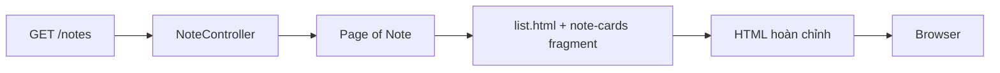

Thymeleaf dùng:

- `${...}` để đọc model/property.
- `#{...}` để lấy message theo locale.
- `@{...}` để tạo URL.
- `*{...}` để bind field trong form object.
- `th:replace` để dùng fragment.
- `sec:authorize` để thay đổi navbar theo login state.

Tài liệu chính thức: [Using Thymeleaf](https://www.thymeleaf.org/doc/tutorials/3.1/usingthymeleaf.html).

### 11.2 Template fragments

| Fragment | Trách nhiệm |
|---|---|
| [head.html](src/main/resources/templates/fragments/head.html) | Meta, title, Bootstrap, CSS, favicon, theme sớm |
| [navbar.html](src/main/resources/templates/fragments/navbar.html) | Navigation, language, theme, user, logout |
| [flash-messages.html](src/main/resources/templates/fragments/flash-messages.html) | Thông báo sau redirect |
| [footer.html](src/main/resources/templates/fragments/footer.html) | Footer dùng chung |
| [delete-modal.html](src/main/resources/templates/fragments/delete-modal.html) | Xác nhận xóa và CSRF |
| [note-cards.html](src/main/resources/templates/notes/fragments/note-cards.html) | Card grid cho initial page và AJAX |

Fragment tránh copy navbar/head/modal vào mọi trang. Khi sửa fragment, tất cả trang dùng nó được
cập nhật.

### 11.3 Responsive grid

Mỗi card dùng:

```html
class="col-12 col-md-6 col-xl-4"
```

| Kích thước | Số card mỗi hàng |
|---|---|
| Mobile | 1 |
| Tablet (`md`) | 2 |
| Desktop lớn (`xl`) | 3 |

`row g-4` tạo gutter ngang/dọc nhất quán. CSS bổ sung màu, shadow, typography, line clamp và
dark-mode variables trong [app.css](src/main/resources/static/css/app.css).

### 11.4 Live search

User gõ vào search box nhưng không gửi request ở mỗi ký tự ngay lập tức. `notes.js` dùng debounce
300 ms:

```text
Gõ ký tự -> hủy timer cũ -> đợi 300 ms -> gửi request
```

Nếu user gõ tiếp trước 300 ms, timer được đặt lại. Điều này giảm request không cần thiết.

### 11.5 Hủy request cũ với AbortController

Ví dụ user gõ `spr`, request A bắt đầu; ngay sau đó user gõ `spring`, request B bắt đầu. Nếu A
trả về sau B, giao diện có thể hiển thị kết quả cũ. Vì vậy code gọi `activeController.abort()`
trước request replace mới.

[MDN — AbortController](https://developer.mozilla.org/docs/Web/API/AbortController) xác nhận controller
có thể hủy Fetch request và response consumption.

### 11.6 Fragment request thay vì JSON

Endpoint:

```text
GET /notes/fragments?q=spring&category=STUDY&page=0
```

trả HTML fragment card đã được Thymeleaf dịch đúng ngôn ngữ. Browser parse fragment và thay/append
card. Lợi ích:

- Không lặp logic render card ở JavaScript.
- Server và initial page dùng cùng một template.
- i18n category/action vẫn nhất quán.
- JavaScript ngắn hơn so với tự dựng DOM từ JSON.

### 11.7 Luồng search/filter/infinite scroll

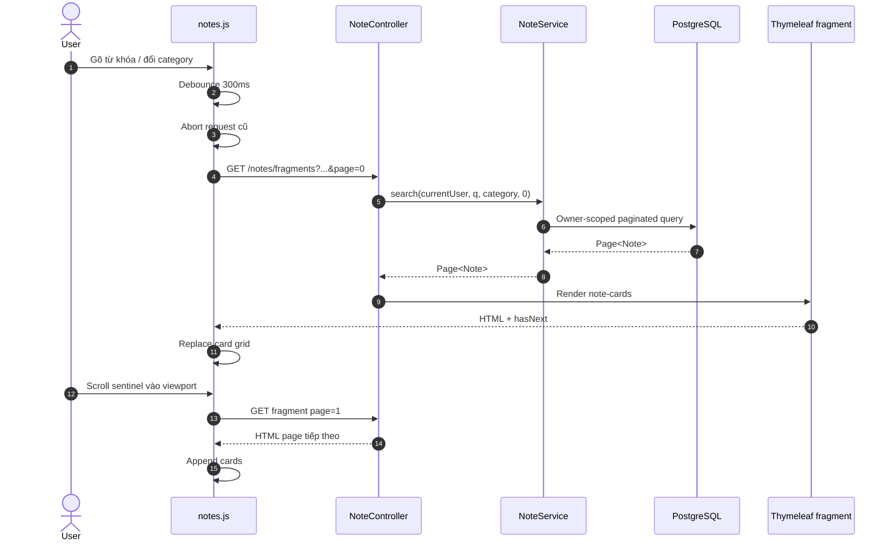

### 11.8 IntersectionObserver

`IntersectionObserver` theo dõi sentinel cuối danh sách. Khi sentinel gần viewport và `hasNext`
là true, code tải page kế tiếp. API này phù hợp infinite scroll và tránh tự xử lý sự kiện scroll
liên tục. Xem [MDN — Intersection Observer API](https://developer.mozilla.org/en-US/docs/Web/API/Intersection_Observer_API).

Nút **Xem thêm** gọi cùng hàm `loadPage`, là fallback rõ ràng cho người dùng.

### 11.9 Delete confirmation

[delete-confirmation.js](src/main/resources/static/js/delete-confirmation.js):

1. Bắt click bằng event delegation, kể cả card được tải sau bằng AJAX.
2. Lấy URL xóa và title từ `data-*`.
3. Điền modal.
4. Submit form POST chứa CSRF token sau khi user xác nhận.

### 11.10 Theme

[theme.js](src/main/resources/static/js/theme.js) hỗ trợ `light`, `dark`, `system`:

- Preference lưu trong `localStorage` với key `note-app-theme`.
- `system` đọc `prefers-color-scheme`.
- Theme được đặt sớm trên `<html data-bs-theme="...">` để hạn chế flash màu sáng.
- Code nghe thay đổi system theme trong lúc trang đang mở.

Bootstrap 5.3 dùng chính `data-bs-theme` cho color modes; xem
[Bootstrap — Color modes](https://getbootstrap.com/docs/5.3/customize/color-modes/).

### 11.11 Internationalization

[LocaleConfig.java](src/main/java/ziang/com/it4409/noteapp/config/LocaleConfig.java):

- Mặc định `vi`.
- Query parameter `?lang=vi` hoặc `?lang=en` đổi locale.
- Cookie `note-app-locale` giữ lựa chọn 365 ngày.

Message bundle:

- [messages.properties](src/main/resources/messages.properties): tiếng Việt mặc định.
- [messages_vi.properties](src/main/resources/messages_vi.properties): locale Việt kế thừa base.
- [messages_en.properties](src/main/resources/messages_en.properties): tiếng Anh.

Category trong DB vẫn là `STUDY`; template hiển thị `Học tập` hoặc `Study`. Nội dung do user nhập
không bị dịch.

### 11.12 Accessibility và UX

- Input có `<label>`.
- Icon-only buttons có title/aria-label.
- Loading/result status có `aria-live`.
- Modal dùng Bootstrap focus management.
- `prefers-reduced-motion` giảm animation.
- Màu sáng/tối có CSS variables riêng.
- Form lỗi hiển thị ngay dưới đúng field.

---

<a id="validation-loi"></a>

## 12. Validation và xử lý lỗi

### 12.1 Tại sao phải validate ở backend?

HTML validation có thể bị tắt hoặc request có thể được gửi bằng công cụ khác. Backend mới là
nguồn quyết định cuối cùng. Jakarta Validation cho phép khai báo constraint trên DTO. Theo
[Jakarta Validation `@NotBlank`](https://jakarta.ee/specifications/bean-validation/3.1/apidocs/jakarta/validation/constraints/notblank),
giá trị phải khác null và có ít nhất một ký tự không phải whitespace.

### 12.2 `RegistrationForm`

| Field | Validation |
|---|---|
| `username` | Required, 3–50 |
| `email` | Required, email hợp lệ, tối đa 254 |
| `password` | Required, 8–72 |
| `confirmPassword` | Required, phải khớp password |

Duplicate username/email là validation liên quan database, được kiểm tra trong service và được
chuyển thành lỗi đúng field với HTTP 409.

### 12.3 `NoteForm`

| Field | Validation |
|---|---|
| `title` | Required, tối đa 150 |
| `content` | Required, tối đa 10.000 |
| `category` | Required |

Không bind browser trực tiếp vào `Note` để browser không thể truyền `id`, `user`, `pinned` hoặc
timestamp ngoài ý muốn.

### 12.4 Error handling tập trung

[GlobalExceptionHandler.java](src/main/java/ziang/com/it4409/noteapp/exception/GlobalExceptionHandler.java)
dùng `@ControllerAdvice` và `@ExceptionHandler`. Spring MVC hỗ trợ xử lý exception controller ở
mức toàn cục bằng cơ chế này; xem
[Spring Framework — Exceptions](https://docs.spring.io/spring-framework/reference/web/webmvc/mvc-controller/ann-exceptionhandler.html).

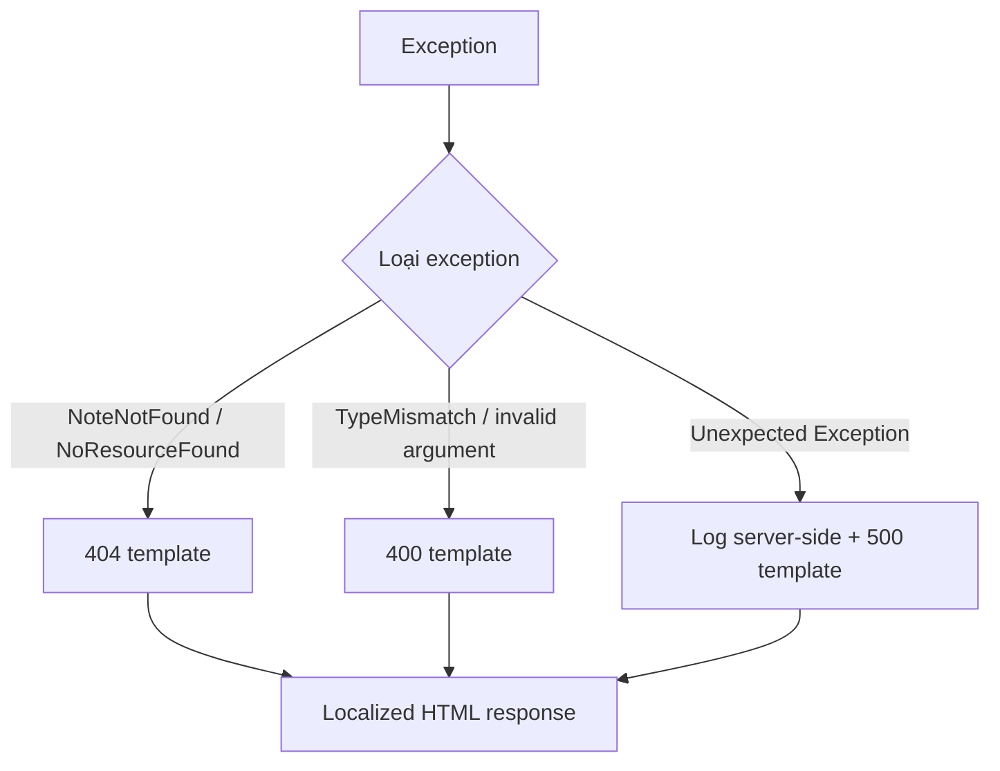

Stack trace không hiển thị cho user. Lỗi ngoài dự kiến được log ở server để debug.

---

<a id="cau-hinh"></a>

## 13. Cấu hình dev, test và prod

### 13.1 Base configuration

[application.yaml](src/main/resources/application.yaml) chứa cấu hình chung:

- Tên application.
- Default profile `dev`.
- Message encoding UTF-8.
- JPA `ddl-auto: update`.
- Time zone `Asia/Bangkok`.
- Port 8080.
- Forwarded headers.
- Không hiển thị stack trace.
- Demo account lấy từ environment với default local.

### 13.2 Development profile

[application-dev.yaml](src/main/resources/application-dev.yaml):

- PostgreSQL tại `localhost:5432`.
- Default local DB credentials.
- Thymeleaf cache tắt để sửa template dễ hơn.
- Logging project ở mức DEBUG.

### 13.3 Test profile

[application-test.yaml](src/test/resources/application-test.yaml):

- H2 in-memory với compatibility mode PostgreSQL.
- Schema `create-drop`.
- Test không cần PostgreSQL/Docker.
- Dữ liệu biến mất sau test.

H2 giúp test nhanh nhưng không thay thế hoàn toàn kiểm thử thật với PostgreSQL.

### 13.4 Production profile

[application-prod.yaml](src/main/resources/application-prod.yaml):

- DB host mặc định là Compose service `postgres`.
- Username/password lấy từ environment.
- Thymeleaf cache bật.
- Logging giảm về INFO.

### 13.5 Vì sao dùng environment variables?

Code và JAR giống nhau giữa các môi trường; chỉ cấu hình khác. Secret không bị hard-code trong
source. Spring Boot hỗ trợ YAML, environment variables và command-line arguments theo cơ chế
externalized configuration; xem
[Spring Boot — Externalized Configuration](https://docs.spring.io/spring-boot/reference/features/external-config.html)
và [Profiles](https://docs.spring.io/spring-boot/reference/features/profiles.html).

| Variable | Dev default | Production |
|---|---|---|
| `DB_HOST` | localhost | postgres hoặc DB host |
| `DB_PORT` | 5432 | 5432 |
| `DB_NAME` | note_app | secret/config |
| `DB_USERNAME` | note_user | secret/config |
| `DB_PASSWORD` | note_password | bắt buộc password mạnh |
| `DEMO_USERNAME` | demo | cấu hình |
| `DEMO_EMAIL` | demo@example.com | cấu hình |
| `DEMO_PASSWORD` | demo12345 | bắt buộc password mạnh |

Template an toàn nằm ở [.env.example](.env.example). File `.env` thật bị `.gitignore`.

---

<a id="chay-local"></a>

## 14. Hướng dẫn chạy local

### 14.1 Điều kiện

- JDK 21 trong IntelliJ IDEA.
- Docker Desktop đang chạy.
- Port 5432 và 8080 chưa bị ứng dụng khác chiếm.

### 14.2 Khởi động PostgreSQL

Tại project root:

```powershell
docker compose -f compose.dev.yaml up -d
```

Kiểm tra:

```powershell
docker compose -f compose.dev.yaml ps
docker compose -f compose.dev.yaml logs postgres
```

Development Compose chỉ bind DB vào `127.0.0.1:5432`, không mở ra toàn LAN.

### 14.3 Chạy từ IntelliJ

Main class đúng:

```text
ziang.com.it4409.noteapp.NoteAppApplication
```

Mở [NoteAppApplication.java](src/main/java/ziang/com/it4409/noteapp/NoteAppApplication.java) và
bấm Run. Sau đó truy cập:

- [Landing page](http://localhost:8080)
- [Login](http://localhost:8080/login)
- [Register](http://localhost:8080/register)
- [Notes](http://localhost:8080/notes)

Local demo:

```text
username: demo
password: demo12345
```

### 14.4 Kiểm tra thủ công cơ bản

1. Mở landing page ở cửa sổ ẩn danh.
2. Đăng ký account A.
3. Tạo note Personal và Study.
4. Tìm theo title/content.
5. Lọc Study.
6. Ghim, sửa, xem detail, xóa.
7. Đổi English và dark mode.
8. Thu nhỏ cửa sổ về mobile.
9. Đăng xuất.
10. Đăng ký account B và xác nhận không thấy note của A.

### 14.5 Dừng database nhưng giữ dữ liệu

```powershell
docker compose -f compose.dev.yaml down
```

Không dùng `down -v` trừ khi muốn xóa toàn bộ database local.

### 14.6 Chạy bằng JAR local

```powershell
.\mvnw.cmd clean package
java -jar target\NoteApp-0.0.1-SNAPSHOT.jar
```

PostgreSQL development vẫn phải đang chạy.

---

<a id="kiem-thu"></a>

## 15. Kiểm thử

### 15.1 Chạy test

```powershell
.\mvnw.cmd test
```

Kết quả gần nhất:

```text
Tests run: 19, Failures: 0, Errors: 0, Skipped: 0
BUILD SUCCESS
```

### 15.2 Test pyramid của dự án

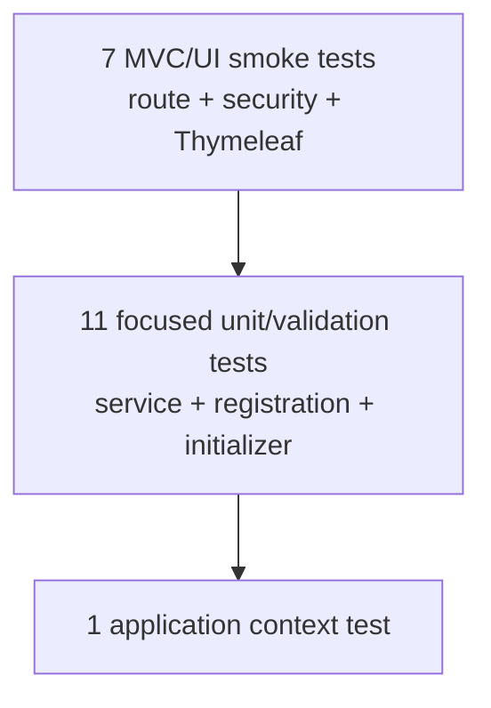

### 15.3 Test matrix

| Test class | Nội dung |
|---|---|
| [RegistrationServiceTest.java](src/test/java/ziang/com/it4409/noteapp/auth/RegistrationServiceTest.java) | Trùng username, trùng email, BCrypt hash |
| [DemoDataInitializerTest.java](src/test/java/ziang/com/it4409/noteapp/config/DemoDataInitializerTest.java) | Initializer idempotent |
| [NoteFormValidationTest.java](src/test/java/ziang/com/it4409/noteapp/note/NoteFormValidationTest.java) | Blank title/content, thiếu category |
| [NoteServiceTest.java](src/test/java/ziang/com/it4409/noteapp/note/NoteServiceTest.java) | Không xem/sửa/xóa note user khác, owner-scoped search, owner khi create |
| [NoteAppApplicationTests.java](src/test/java/ziang/com/it4409/noteapp/NoteAppApplicationTests.java) | Spring context load |
| [UiSmokeTest.java](src/test/java/ziang/com/it4409/noteapp/web/UiSmokeTest.java) | Landing/login/favicon/list/fragment/i18n/detail/404/validation |

### 15.4 Unit test và integration test khác nhau

- Unit test dùng Mockito để cô lập service/repository dependency, chạy nhanh và kiểm tra đúng nhánh.
- `@SpringBootTest` tạo application context gần thực tế hơn.
- MockMvc gửi request qua Spring MVC/Security mà không cần mở port thật.
- H2 giúp test database flow nhưng production vẫn là PostgreSQL.

### 15.5 Test thủ công vẫn cần thiết

Automated tests không đánh giá hoàn toàn:

- Giao diện có đẹp không.
- Breakpoint mobile thực tế.
- Trình duyệt và cache.
- Docker network/PostgreSQL thật.
- Cloudflare Tunnel và domain thật.

Vì vậy cần cả test tự động và checklist thủ công.

---

<a id="trien-khai"></a>

## 16. Đóng gói và triển khai

### 16.1 Local development topology

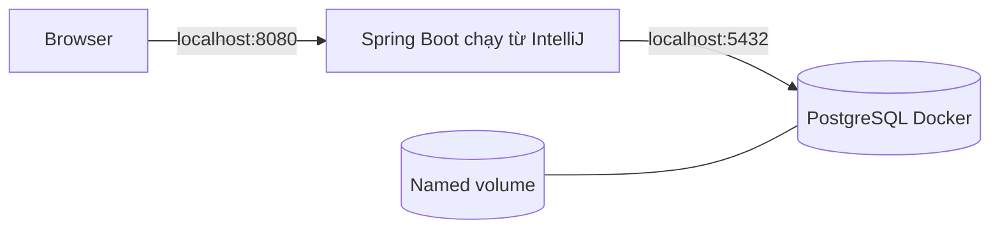

### 16.2 Production Docker topology

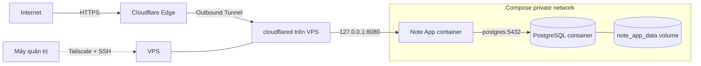

### 16.3 Multi-stage Dockerfile

[Dockerfile](Dockerfile) có hai stage:

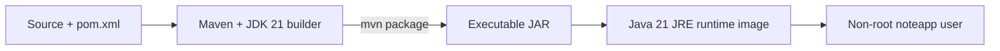

Builder cần Maven/JDK; runtime chỉ cần JRE và JAR. Docker khuyến nghị multi-stage build để giảm
kích thước và attack surface của image cuối; xem
[Docker — Multi-stage builds](https://docs.docker.com/get-started/docker-concepts/building-images/multi-stage-builds/).

### 16.4 Production Compose

[compose.yaml](compose.yaml) khai báo:

- `postgres` với named volume và health check.
- `note-app` build từ Dockerfile.
- App chỉ start sau khi PostgreSQL healthy.
- App bind `127.0.0.1:8080:8080`.
- PostgreSQL không publish port.
- Cả hai dùng `restart: unless-stopped`.

Docker Compose chỉ đảm bảo dependency start order theo điều kiện health khi dùng
`condition: service_healthy`; xem
[Docker — Startup order](https://docs.docker.com/compose/how-tos/startup-order/).

Named volume tồn tại ngoài lifecycle container, nên recreate container không làm mất data. Xem
[Docker — Volumes](https://docs.docker.com/engine/storage/volumes/).

### 16.5 Deploy bằng Docker Compose

Trên VPS:

```bash
cp .env.example .env
nano .env
docker compose up -d --build
docker compose ps
docker compose logs -f note-app
```

Phải thay password placeholder bằng secret mạnh. Không commit `.env`.

Dừng mà giữ data:

```bash
docker compose down
```

### 16.6 Deploy JAR + systemd — phương án thay thế

Project vẫn tạo executable JAR. Nếu chọn cách quen thuộc:

1. Build `mvnw clean package`.
2. Copy JAR lên VPS.
3. Chạy PostgreSQL riêng/Docker.
4. Tạo systemd service với `SPRING_PROFILES_ACTIVE=prod` và các DB/DEMO variables.
5. Service chạy `java -jar /opt/note-app/app.jar`.

Không nên chạy song song app container và systemd JAR trên cùng port 8080. Chọn một phương án.

### 16.7 Cloudflare Tunnel

Cloudflare Tunnel tạo kết nối outbound từ máy chạy app tới Cloudflare nên không cần mở inbound
port 8080. Production route trỏ hostname tới:

```text
http://localhost:8080
```

Tài liệu chính thức:

- [Cloudflare Tunnel setup](https://developers.cloudflare.com/tunnel/setup/)
- [Quick Tunnels](https://developers.cloudflare.com/cloudflare-one/networks/connectors/cloudflare-tunnel/do-more-with-tunnels/trycloudflare/)

Test tạm với bạn bè:

```powershell
cloudflared tunnel --url http://localhost:8080
```

Quick Tunnel chỉ dành cho development/testing. Production dùng named/remotely-managed tunnel và
hostname cố định.

### 16.8 Tailscale dùng để làm gì?

Tailscale và Cloudflare Tunnel có vai trò khác nhau:

| Công cụ | Người dùng | Mục đích |
|---|---|---|
| Cloudflare Tunnel | Giảng viên/public | Truy cập website HTTPS |
| Tailscale | Chủ server/admin | SSH, quản trị private |

Nếu muốn public trực tiếp qua Tailscale, Funnel cũng có thể reverse proxy local service, nhưng
project dự kiến dùng Cloudflare cho public hostname. Xem
[Tailscale Funnel](https://tailscale.com/kb/1223/funnel).

### 16.9 Forwarded headers

Cloudflare kết thúc HTTPS rồi chuyển request tới app qua HTTP localhost. Cấu hình:

```yaml
server:
  forward-headers-strategy: framework
```

giúp Spring hiểu forwarded scheme/host khi đứng sau reverse proxy.

### 16.10 Backup

Named volume là persistence, **không phải backup**. Trước thay đổi quan trọng nên dùng `pg_dump`:

```bash
docker compose exec -T postgres pg_dump -U note_user note_app > note_app_backup.sql
```

File backup phải được cất ngoài container/VPS nếu cần khả năng khôi phục khi VPS mất.

---

<a id="kich-ban-demo"></a>

## 17. Kịch bản demo với giảng viên

### 17.1 Kịch bản 8–10 phút

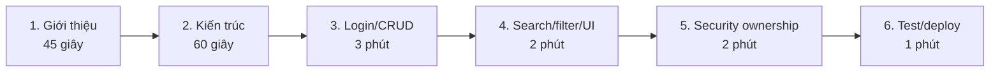

#### Phần 1 — Bài toán

> “Em xây dựng NoteFlow, một ứng dụng quản lý ghi chú cá nhân. Sản phẩm đáp ứng CRUD, mỗi note
> gắn với một user, có category để lọc, validation, responsive UI và xử lý lỗi tập trung.”

#### Phần 2 — Kiến trúc

> “Ứng dụng là Spring Boot monolith theo layered architecture. Controller nhận HTTP, Service xử
> lý nghiệp vụ và ownership, Repository truy cập PostgreSQL, Thymeleaf render HTML. JavaScript
> chỉ phụ trách tương tác như live search và infinite scroll.”

#### Phần 3 — Demo chức năng

1. Mở landing page.
2. Login tài khoản demo.
3. Tạo note với title/content/category.
4. Xem danh sách và chi tiết.
5. Edit note.
6. Pin note để thấy sort thay đổi.
7. Xóa note qua modal.

#### Phần 4 — Giao diện nâng cao

1. Search một từ trong title/content.
2. Filter category.
3. Đổi tiếng Anh.
4. Đổi dark/light/system.
5. Thu nhỏ màn hình để thấy 3 → 2 → 1 cột.

#### Phần 5 — Security demo

1. Chuẩn bị account A và B.
2. A tạo note, ghi lại ID từ URL.
3. Login B.
4. B nhập trực tiếp `/notes/{id-của-A}`.
5. Hệ thống trả 404.

Sau đó mở [NoteRepository.java](src/main/java/ziang/com/it4409/noteapp/note/NoteRepository.java)
và chỉ ra `findByIdAndUserId`.

#### Phần 6 — Test và deploy

> “Project có 19 automated tests. Local chạy Spring Boot từ IDE và PostgreSQL trong Docker.
> Production có Docker Compose, persistent volume, health check và Cloudflare Tunnel chỉ expose
> app, không expose database.”

### 17.2 Ba file nên mở sẵn khi vấn đáp

1. [SecurityConfig.java](src/main/java/ziang/com/it4409/noteapp/config/SecurityConfig.java)
2. [NoteService.java](src/main/java/ziang/com/it4409/noteapp/note/NoteService.java)
3. [NoteRepository.java](src/main/java/ziang/com/it4409/noteapp/note/NoteRepository.java)

Thêm tab [NoteController.java](src/main/java/ziang/com/it4409/noteapp/note/NoteController.java),
[notes.js](src/main/resources/static/js/notes.js) và [compose.yaml](compose.yaml) nếu còn thời gian.

### 17.3 Những câu không nên nói sai

| Không nên nói | Nên nói đúng |
|---|---|
| “BCrypt mã hóa password” | “BCrypt băm một chiều password” |
| “Login là đủ để bảo mật note” | “Login xác thực; owner query mới phân quyền dữ liệu” |
| “Frontend validation bảo mật input” | “Backend Jakarta Validation là authoritative” |
| “Docker volume là backup” | “Volume giữ persistence; backup cần pg_dump/off-site” |
| “Database không thể bị truy cập” | “Database không publish port; vẫn cần secret và host security” |
| “Infinite scroll tải hết dữ liệu” | “Nó tải từng page 12 bản ghi” |
| “Thymeleaf là frontend framework như React” | “Thymeleaf là server-side template engine” |

---

<a id="van-dap"></a>

## 18. Câu hỏi vấn đáp thường gặp

### Q1. Vì sao chọn Spring Boot?

Spring Boot giảm cấu hình thủ công, có embedded server, tích hợp Security/JPA/Validation/Thymeleaf
và đóng gói thành executable JAR. Nó phù hợp yêu cầu Web CRUD và deployment đơn giản.

### Q2. `@Controller` khác `@RestController` thế nào?

`@Controller` thường trả view name để Thymeleaf render HTML. `@RestController` mặc định ghi return
value vào response body, thường dùng JSON API. Dự án dùng server-rendered MVC nên chọn
`@Controller`.

### Q3. Controller, Service, Repository khác nhau thế nào?

Controller xử lý HTTP; Service giữ nghiệp vụ, transaction và owner rule; Repository truy cập DB.
Tách lớp giúp tránh controller quá lớn và dễ test.

### Q4. Dependency Injection là gì?

Các class không tự `new` repository/service. Spring tạo bean và truyền dependency qua constructor.
Điều này giảm coupling và giúp test bằng mock.

### Q5. JPA và Hibernate khác nhau thế nào?

JPA là specification/API chuẩn. Hibernate là implementation thực hiện mapping và SQL runtime.
Spring Data JPA tạo abstraction repository phía trên JPA.

### Q6. Tại sao dùng DTO thay vì bind thẳng entity?

DTO chỉ expose field được phép nhập, chứa validation dành cho form và tránh mass assignment vào
owner, ID, pinned hay timestamps.

### Q7. Tại sao `Note` là `ManyToOne` với `User`?

Nhiều note thuộc một user; một note chỉ có một owner. Đây là quan hệ N–1.

### Q8. Làm sao bảo đảm user A không xem note user B?

Backend lấy username từ Spring Security, tìm user ID rồi query `findByIdAndUserId`. Không có
`userId` từ browser. Nếu không có kết quả, trả 404.

### Q9. Vì sao không chỉ `findById(noteId)` rồi kiểm tra Java?

Query trực tiếp `id AND userId` giảm khả năng vô tình trả entity của user khác, không tiết lộ
tồn tại và làm security constraint gần data access hơn.

### Q10. Authentication và authorization khác gì?

Authentication xác định danh tính; authorization xác định quyền. Login là authentication;
owner-scoped query là authorization.

### Q11. Password có giải mã được không?

Không. BCrypt là hash một chiều. Khi login, encoder hash/so khớp password nhập với stored hash.

### Q12. Salt dùng làm gì?

Salt làm cùng một password có thể sinh hash khác nhau giữa các user và chống bảng rainbow. BCrypt
quản lý salt trong encoded result.

### Q13. CSRF là gì và project chống thế nào?

CSRF lợi dụng cookie đăng nhập tự động để gửi request thay user. Spring Security yêu cầu CSRF
token ở POST; Thymeleaf chèn token vào form.

### Q14. Vì sao delete không dùng GET?

GET nên an toàn/idempotent về mặt thay đổi state. Delete là state-changing action nên dùng POST
với CSRF và modal xác nhận.

### Q15. Vì sao trả 404 khi truy cập note user khác?

Để không tiết lộ note ID đó có tồn tại hay không. Cùng response với note không tồn tại.

### Q16. Tại sao category lưu English code?

Code ổn định, độc lập ngôn ngữ. UI dịch bằng message bundle; đổi locale không cần sửa DB.

### Q17. Search có chống SQL injection không?

JPQL dùng named parameters (`:keyword`, `:userId`, `:category`), Spring/Hibernate bind parameter
thay vì nối input vào câu SQL. Tuy vậy wildcard `%` vẫn làm search substring và có chi phí hiệu năng.

### Q18. Vì sao page size là 12?

12 chia đều cho grid 1, 2 hoặc 3 cột, đủ nội dung mỗi request nhưng không quá lớn.

### Q19. Vì sao sort cần `id DESC` cuối cùng?

`pinned` và `updatedAt` có thể bằng nhau. ID là tie-breaker tạo stable ordering cho pagination.

### Q20. Debounce 300 ms là gì?

Chỉ gửi search sau khi user ngừng gõ 300 ms, tránh request ở mọi keystroke.

### Q21. AbortController giải quyết gì?

Hủy request search cũ để response chậm của từ khóa cũ không ghi đè kết quả mới.

### Q22. Infinite scroll hoạt động thế nào?

IntersectionObserver theo dõi sentinel. Khi gần viewport và `hasNext=true`, JS yêu cầu page tiếp
theo rồi append HTML card.

### Q23. Tại sao fragment trả HTML thay vì JSON?

Card được render một lần bằng Thymeleaf cho cả initial page và AJAX, giảm duplicate rendering
logic và giữ i18n nhất quán.

### Q24. `@Transactional` dùng để làm gì?

Bao quanh operation DB trong transaction. Read-only giúp biểu đạt query intent; write transaction
giúp commit/rollback nhất quán.

### Q25. `ddl-auto: update` có phù hợp production lớn không?

Không phải lựa chọn tốt cho hệ thống lớn. Đồ án cho phép vì nhỏ. Production trưởng thành nên dùng
versioned migrations như Flyway/Liquibase.

### Q26. Data có mất khi restart container không?

Không nếu dùng named volume và chỉ recreate/down container bình thường. Data sẽ mất nếu xóa volume
hoặc storage host hỏng; vì vậy vẫn cần backup.

### Q27. `depends_on: service_healthy` để làm gì?

App đợi PostgreSQL health check pass trước khi start, giảm lỗi connection lúc DB chưa sẵn sàng.

### Q28. Cloudflare Tunnel khác mở port router thế nào?

Tunnel tạo outbound connection tới Cloudflare, nên không cần public inbound port 8080. Cloudflare
cấp HTTPS/public hostname và proxy tới localhost.

### Q29. Tailscale có thay Cloudflare không?

Có thể trong một số mô hình, nhưng dự án phân vai: Cloudflare cho website public; Tailscale cho
quản trị private/SSH.

### Q30. Hệ thống còn điểm gì cần cải thiện?

Có thể thêm migration, backup automation, rate limiting, password change/reset, email verification,
full-text index, audit log và browser E2E tests. Không thêm vào bản hiện tại để giữ đúng scope.

---

<a id="troubleshooting"></a>

## 19. Troubleshooting

### 19.1 Sai main class do chữ hoa/chữ thường

Lỗi:

```text
wrong name: ziang/com/it4409/noteapp/NoteAppApplication
```

Run configuration phải là:

```text
ziang.com.it4409.noteapp.NoteAppApplication
```

Không dùng package cũ `ziang.com.it4409.NoteApp`.

### 19.2 PostgreSQL connection refused

Kiểm tra Docker Desktop và container:

```powershell
docker compose -f compose.dev.yaml ps
docker compose -f compose.dev.yaml logs postgres
```

Kiểm tra port 5432 có bị PostgreSQL khác chiếm không.

### 19.3 Port 8080 đã bị dùng

Windows:

```powershell
netstat -ano | findstr :8080
```

Dừng process cũ hoặc chạy app với port khác tạm thời:

```powershell
java -jar target\NoteApp-0.0.1-SNAPSHOT.jar --server.port=8081
```

### 19.4 Login demo không nhận password mới

Initializer không overwrite user đã tồn tại. Thay environment variable chỉ ảnh hưởng lần tạo đầu.
Với local disposable DB, có thể chủ động xóa volume rồi tạo lại, nhưng thao tác này xóa toàn bộ
notes/users và chỉ thực hiện khi chắc chắn.

### 19.5 POST trả 403

Khả năng cao thiếu/sai CSRF token hoặc session đã hết hạn. Dùng Thymeleaf `th:action` cho form POST
và đăng nhập lại nếu session expired.

### 19.6 Truy cập note trả 404

Có ba khả năng hợp lệ:

1. Note không tồn tại.
2. Note đã bị xóa.
3. Note thuộc user khác.

Hệ thống cố ý không phân biệt ba trường hợp ở response.

### 19.7 CSS/HTML chưa cập nhật

- Hard refresh `Ctrl+F5`.
- DevTools: Disable cache khi đang mở.
- Đảm bảo profile `dev` để Thymeleaf cache tắt.
- Restart application nếu thay đổi class/template chưa được IDE hot reload.

### 19.8 Favicon 404

Project đã có [favicon.svg](src/main/resources/static/favicon.svg) và redirect `/favicon.ico`.
Nếu còn log cũ, restart app và hard refresh.

### 19.9 Docker daemon không chạy

Mở Docker Desktop và chờ engine báo Running trước khi gọi `docker compose`.

### 19.10 Cloudflare Quick Tunnel không tạo URL

- Kiểm tra app hoạt động ở `http://localhost:8080`.
- Kiểm tra `cloudflared --version`.
- Kiểm tra firewall/network outbound.
- Quick Tunnel có thể không hoạt động nếu có config file không tương thích trong thư mục
  `.cloudflared`; xem tài liệu Quick Tunnel chính thức.

### 19.11 Giao diện mất Bootstrap/icon

Bootstrap CSS/JS và Bootstrap Icons đang tải từ CDN. Nếu máy client chặn Internet/CDN, giao diện
vẫn có HTML nhưng style/icon có thể thiếu. Production cần outbound/browser access tới CDN hoặc nên
self-host các asset nếu muốn hoạt động hoàn toàn offline.

### 19.12 Maven báo `JAVA_HOME environment variable is not defined correctly`

Đây là lỗi môi trường Java, không phải lỗi source. Trên Windows, kiểm tra IntelliJ đang dùng JDK 21
và `JAVA_HOME` trỏ tới đúng thư mục JDK. Nếu chạy Maven từ WSL trong khi Java chỉ được cài ở Windows,
có thể chạy wrapper Windows ngay tại thư mục project:

```bash
/mnt/c/Windows/System32/cmd.exe /d /c "mvnw.cmd test"
```

Hoặc cài JDK 21 bên trong WSL rồi khai báo `JAVA_HOME` cho shell đó. Không trỏ `JAVA_HOME` vào file
`java.exe`; biến này phải trỏ vào **thư mục gốc của JDK**.

---

<a id="gioi-han"></a>

## 20. Giới hạn và hướng phát triển

### Giới hạn hiện tại

- Không có email verification hoặc password reset.
- Không có đổi password trong UI.
- Không có admin dashboard.
- Không có recycle bin; xóa là vĩnh viễn.
- Không có attachment, rich text hay Markdown editor.
- Search dùng `LIKE '%keyword%'`, chưa dùng PostgreSQL full-text search.
- Không có optimistic locking (`@Version`); concurrent edits theo mô hình last write wins.
- Không có audit history.
- `ddl-auto: update` thay vì migration.
- Chưa có browser E2E test thật như Playwright/Selenium.
- Chưa có rate limiting ở application layer.
- Bootstrap/icon phụ thuộc CDN.

### Hướng phát triển hợp lý

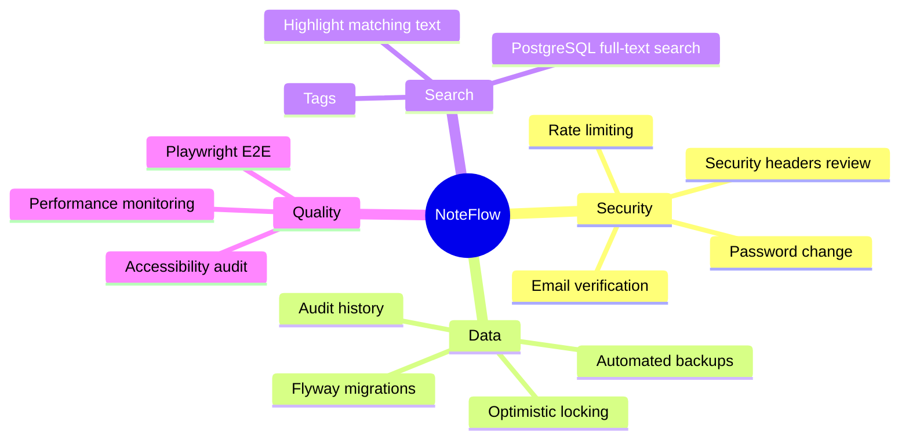

Những chức năng này là hướng phát triển, không nên thêm gấp trước vấn đáp nếu làm tăng rủi ro.

---

<a id="checklist"></a>

## 21. Checklist nộp bài

### 21.1 Nội dung bắt buộc trong PDF

- [ ] Tên file đúng: `[IT4409]_CuoiKy20252_MaSoHocVien_HoTenHocVien.pdf`
- [ ] Mã số học viên.
- [ ] Họ tên.
- [ ] Email.
- [ ] Mô tả chức năng.
- [ ] Hướng dẫn chạy.
- [ ] Sơ đồ kiến trúc đơn giản.
- [ ] Công nghệ sử dụng.
- [ ] Link repository public/accessible.
- [ ] Link demo đang hoạt động.
- [ ] Demo username/password đã kiểm tra.

### 21.2 Ảnh nên chụp

- [ ] Landing page desktop.
- [ ] Danh sách note có nhiều category.
- [ ] Form tạo note và validation error.
- [ ] Detail/edit/delete modal.
- [ ] Search/filter.
- [ ] Dark mode.
- [ ] English mode.
- [ ] Mobile responsive layout.
- [ ] 404 khi account B truy cập note account A.
- [ ] Terminal `Tests run: 19 ... BUILD SUCCESS`.
- [ ] Docker Compose services healthy.
- [ ] Public demo URL.

### 21.3 Trước giờ vấn đáp

- [ ] Backup database.
- [ ] Restart services.
- [ ] Kiểm tra domain bằng mạng ngoài/Wi-Fi khác.
- [ ] Login demo account.
- [ ] Tạo/sửa/xóa một note thử.
- [ ] Kiểm tra tiếng Việt/Anh và theme.
- [ ] Mở sẵn ba file security quan trọng.
- [ ] Chuẩn bị account A/B để demo ownership.
- [ ] Tắt notification cá nhân khi share screen.
- [ ] Có phương án dự phòng: video/ảnh và local JAR nếu mạng lỗi.

---

<a id="tai-lieu-tham-khao"></a>

## 22. Tài liệu chính thức

### Java và Spring

- [Java 21 Documentation — Oracle](https://docs.oracle.com/en/java/javase/21/)
- [Spring Boot Reference](https://docs.spring.io/spring-boot/reference/)
- [Spring Boot Profiles](https://docs.spring.io/spring-boot/reference/features/profiles.html)
- [Spring Boot Externalized Configuration](https://docs.spring.io/spring-boot/reference/features/external-config.html)
- [Spring Security Username/Password Authentication](https://docs.spring.io/spring-security/reference/servlet/authentication/passwords/)
- [Spring Security Form Login](https://docs.spring.io/spring-security/reference/7.0/servlet/authentication/passwords/form.html)
- [Spring Security Password Storage](https://docs.spring.io/spring-security/reference/features/authentication/password-storage.html)
- [Spring Security CSRF](https://docs.spring.io/spring-security/reference/servlet/exploits/csrf.html)
- [Spring Data JPA](https://docs.spring.io/spring-data/jpa/reference/jpa.html)
- [Spring Data Repository Core Concepts](https://docs.spring.io/spring-data/jpa/reference/repositories/core-concepts.html)
- [Spring MVC Exception Handling](https://docs.spring.io/spring-framework/reference/web/webmvc/mvc-controller/ann-exceptionhandler.html)
- [Jakarta Bean Validation](https://jakarta.ee/learn/docs/jakartaee-tutorial/9.1/beanvalidation/bean-validation/bean-validation.html)

### Frontend

- [Thymeleaf 3.1 Tutorial](https://www.thymeleaf.org/doc/tutorials/3.1/usingthymeleaf.html)
- [Thymeleaf + Spring Tutorial PDF](https://www.thymeleaf.org/doc/tutorials/3.1/thymeleafspring.pdf)
- [Bootstrap 5.3 Color Modes](https://getbootstrap.com/docs/5.3/customize/color-modes/)
- [Bootstrap Navbar](https://getbootstrap.com/docs/5.3/components/navbar/)
- [MDN AbortController](https://developer.mozilla.org/docs/Web/API/AbortController)
- [MDN Intersection Observer API](https://developer.mozilla.org/en-US/docs/Web/API/Intersection_Observer_API)

### Database và deployment

- [PostgreSQL 17 Documentation](https://www.postgresql.org/docs/17/)
- [PostgreSQL Unique Indexes](https://www.postgresql.org/docs/17/indexes-unique.html)
- [Docker Multi-stage Builds](https://docs.docker.com/get-started/docker-concepts/building-images/multi-stage-builds/)
- [Docker Compose Startup Order](https://docs.docker.com/compose/how-tos/startup-order/)
- [Docker Volumes](https://docs.docker.com/engine/storage/volumes/)
- [Cloudflare Tunnel Setup](https://developers.cloudflare.com/tunnel/setup/)
- [Cloudflare Quick Tunnels](https://developers.cloudflare.com/cloudflare-one/networks/connectors/cloudflare-tunnel/do-more-with-tunnels/trycloudflare/)
- [Tailscale Funnel](https://tailscale.com/kb/1223/funnel)

---

<a id="phu-luc"></a>

## 23. Phụ lục lệnh thường dùng

### Development

```powershell
# Start PostgreSQL
docker compose -f compose.dev.yaml up -d

# Check status
docker compose -f compose.dev.yaml ps

# Follow database logs
docker compose -f compose.dev.yaml logs -f postgres

# Stop while preserving data
docker compose -f compose.dev.yaml down
```

### Maven

```powershell
# Run all tests
.\mvnw.cmd test

# Clean, test and package executable JAR
.\mvnw.cmd clean package

# Run JAR
java -jar target\NoteApp-0.0.1-SNAPSHOT.jar
```

### Production Compose

```bash
# Validate effective configuration
docker compose config

# Build and start
docker compose up -d --build

# View status and logs
docker compose ps
docker compose logs -f note-app

# Stop without deleting data
docker compose down
```

### Temporary public test

```powershell
cloudflared tunnel --url http://localhost:8080
```

### PostgreSQL backup and restore

```bash
# Backup
docker compose exec -T postgres pg_dump -U note_user note_app > note_app_backup.sql

# Restore into an empty/appropriate database
cat note_app_backup.sql | docker compose exec -T postgres psql -U note_user -d note_app
```

### URL test checklist

```text
GET  /
GET  /login
GET  /register
GET  /notes
GET  /notes/new
GET  /notes/{id}
GET  /notes/{id}/edit
GET  /notes/fragments?q=&category=&page=0
```

---

## Kết luận

NoteFlow đáp ứng toàn bộ yêu cầu chính của đề IT4409: CRUD đầy đủ, dữ liệu theo user, category
filter, responsive UI, validation và xử lý lỗi tập trung. Điểm kỹ thuật nổi bật là ownership được
enforcement tại mọi query, Spring Security session + CSRF, BCrypt password hashing, server-rendered
Thymeleaf fragments, live search có debounce/cancellation, stable pagination và deployment tách
app/database.

Nếu chỉ nhớ một nguyên tắc trước khi vấn đáp, hãy nhớ:

> **User không được quyền sở hữu note vì browser gửi `userId`; user được quyền vì backend lấy
> danh tính đã xác thực và query note bằng chính owner ID đó.**
